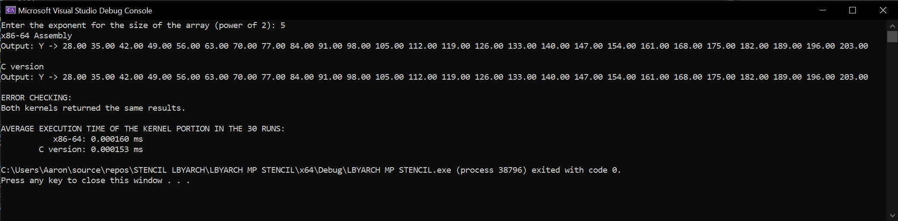

# Comparative Execution Time and Performance Analysis

## Overview

This repository contains benchmarks for two kernels implemented in x86-64 assembly and C language, each run 30 times. Below is a comparative analysis of the execution times and performance of these kernels.

The program only works in Debug Mode

## Execution Time
Time process for vector size n = {220, 224, and  227}. The machine can only support up until 227.

The Kernel portion was looped 30 times where the average execution time for each vector size is presented in the table below.

Debug Mode
| Kernel          | Language | 220 Average (ms)     | 224 Average (ms)      | 227 Average (ms)    |
|-----------------|----------|---------------------------------|----------------------------------|--------------------------------|
| x86-64 Assembly | Assembly | 3.838503 ms                     | 63.158463 ms                     | 590.348693 ms                  | 
| C Version       | C        | 3.316153 ms                     | 58.418847 ms                     | 485.967457 ms                  |

!Release Mode is not working!

## Analysis

### Average Execution Time

- For x86-64 Assembly:
  - Average Execution Time (Assembly) = (Σ Execution Time of 30 Runs) / 30

- For C Language:
  - Average Execution Time (C) = (Σ Execution Time of 30 Runs) / 30

### Insights

- In lower vector sizes, the x86-64 Assembly kernel demonstrates consistently lower execution times across multiple runs compared to the C implementation.
- Meanwhile, in higher vector sizes, the x86-64 Assembly kernel demonstrates consistently higher execution times across multiple runs compared to the C implementation.
- Variability in execution time across runs for each kernel can indicate factors such as system load, memory/cache behavior, or compiler optimizations.
- Further analysis may involve profiling to identify specific areas for optimization in the C implementation and especially exploring optimizations in the assembly code.

## II. and III. Screenshot of the program output with the correctness check C and x86-64.

